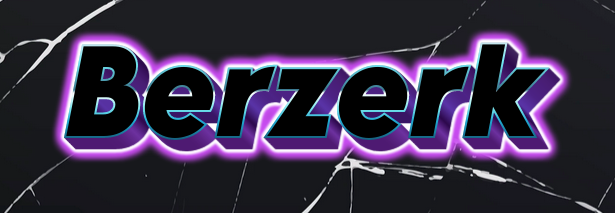

[](https://www.python.org/) 


<p align = "center"></p>
 <p align="left">
	<h4 align="left"> Berzerk is a post exploitation persistence maintaining backdoor along with C2 (COMMAND &amp; CONTROL ) server developed using python's Flask framework. Developed to be used only in post exploitation scenarios. The powershell payload provided is currently undetectable by the latest updated version of windows defender on windows 11 as of 8th April 2024 22:00 IST if used with proper obfuscation techniques. 
FOR obfuscation details on powershell scripts refer to https://github.com/t3l3machus/PowerShell-Obfuscation-Bible 
<h4></p>
<p>
<h5 align = "left"> **The program is still in early stages of development and implements only the basic functionality of a C2 server as of now, more features are expected to be added soon. Feel free to contribute</h5>
</p>
<p>
<h5 align = "left"> **Please use this for educational or Red team purposes only and dont run the code and payload on computers you dont have permission to test, The authors are not liable for any misuse.</h5>
</p>

## Files Included:
- `berzerk.py` - It includes the main C2 server, It takes one command line argument
- `detect_users.py` - It lets you see the available victims you can connect to using the C2 server.
- `berzerk.ps1` - It is the main paylod to be installed in the victim PC, preferably in post exploitation scenario as a backdoor.

## Instructions to run
* __Pre-requisites:__
	-  Latest version of python and flask. (KALI LINUX is required to use the interactive shell feature)

* __Setup on the victim PC__
	- Transfer the `berzerk.ps1` into the victim PC and preferably store it in the startup folder for future easy access, Change the IP and PORT as per your values

* __Setup on attacker PC__
  - Open your server in a terminal, go in the folder where the repository is cloned.
  - Configure the server IP and Port for the flask server in both `berzerk.py` and `detect_users.py` if required.
* __Run the attack__
     - Go to your terminal, and run:
     <br>```python detect_users.py```<br>
     <br><br>
     You will see the available users with backdoor established. Make a note of the Hostname that you want to connect to.<br>
     - To pop into the shell of the desired user, run the following command:
        ```python berzerk.py <HOSTNAME>```
	<br><br>

 * __NOTE__
      - This will only spawn a non interactive shell which will hang if you execute commands which spawns as interactive session such as 'cmd.exe' etc. TO use the interactive shell feature we have used a combination of a couple open source tools like netcat. For instructions on how to use the interactive shell refer to the [WiKi](https://github.com/anonymous300502/Berzerk/wiki)

## Built with
- Python
- Powershell
- C# (C-Sharp)

## Contributors
* [Manaswi Sharma](https://github.com/manaswii)

<br>
<p align="center">
	Made during 🌙 by Abhishek Sharma
</p>
